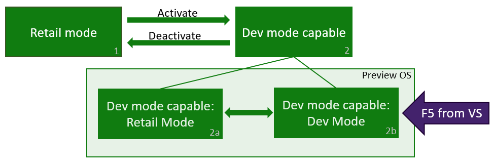

# Activation du mode développeur XboxOne

## Fonctionnement du Mode développeur
La console Xbox One possède deux modes : le mode *Commercial* (**1**) et le mode *Développeur* (**2**). En Mode commercial, la console permet à n’importe quel utilisateur de jouer et d’exécuter des applications en tant qu’utilisateur. Le Mode développeur, vous permet de développer des logiciels pour la console, mais pas de jouer à des jeux commerciaux ou d’exécuter des applications commerciales.

Ce mode peut être activé sur n’importe quelle console Xbox One commerciale. Une fois le Mode développeur activé, vous pouvez basculer entre le mode commercial (**2a**) et le mode développeur (**2b**).

## Activer le Mode développeur sur votre console Xbox One commerciale

1.  Démarrez votre console Xbox One.

2.  Recherchez l’application **Dev Mode Activation** dans le Marché Xbox One et installez-la.

    

3.  Lancez l’application à partir de la page du Store.

    

4.  Notez le code affiché dans l’application Dev Mode Activation.

      
    
5.  [Inscription d’un compte de développeur d’application dans l’espace partenaires](https://developer.microsoft.com/store/register).  Il s’agit également de la première étape de la publication du jeu.

6.  Connectez-vous à [L’espace partenaires](https://partner.microsoft.com/dashboard) avec votre compte de développeur d’application partenaires valide, en cours.  Si vous ne voyez pas plusieurs options dans le volet de navigation de gauche, ou que vous ne voyez pas la possibilité de **créer une application** dans la section **vue d’ensemble** , les étapes suivantes et l’activation des liens _ne fonctionnera pas_; Assurez-vous que vous avez enregistré entièrement votre compte de développeur d’application à partir de l’étape précédente.

7.  Accédez à [partner.microsoft.com/xboxconfig/devices](https://partner.microsoft.com/xboxconfig/devices).

8.  Entrez le code d’activation affiché dans l’application Dev Mode Activation. Vous disposez d’un nombre limité d’activations associées à votre compte. Une fois que le Mode développeur a été activé, l’espace partenaires indiquera que vous avez utilisé une des activations associées à votre compte.

        
    
9.  Cliquez sur **Accepter et activer**. La page sera rechargée et votre appareil apparaîtra dans le tableau. Pour plus d’informations, voir [Programme d’activation du mode développeur Xbox One](https://go.microsoft.com/fwlink/p/?LinkId=760399).

10. Après avoir saisi votre code d’activation, votre console affiche un écran de progression pour le processus d’activation.  
    
11. Une fois l’activation est terminée, ouvrez l’application Dev Mode Activation, puis cliquez sur **Basculer et redémarrer** pour accéder au Mode développeur. Notez que cette opération peut être plus longue que d’habitude.

       

## Basculer entre le Mode commercial et développeur
Une fois le Mode développeur activé sur votre console, utilisez **Dev Home** pour basculer entre le Mode commercial et développeur. Pour en savoir plus sur le démarrage et l’utilisation de Dev Home, consultez [Présentation des outils XboxOne](introduction-to-xbox-tools.md).

* Pour basculer en Mode commercial, ouvrez **Accueil du développeur**. Sous **Actions rapides**, sélectionnez **Quitter le mode développeur**. Cette action a pour effet de redémarrer votre console en Mode commercial.    

    
  
* Pour basculer vers le Mode développeur, utilisez l’application Dev Mode Activation. Ouvrez l’application et sélectionnez **Basculer et redémarrer**. Cette action a pour effet de redémarrer votre console en Mode développeur.  

    

## Voir aussi
- [Désactivation du Mode développeur XboxOne](devkit-deactivation.md)
- [UWP sur XboxOne](index.md)
