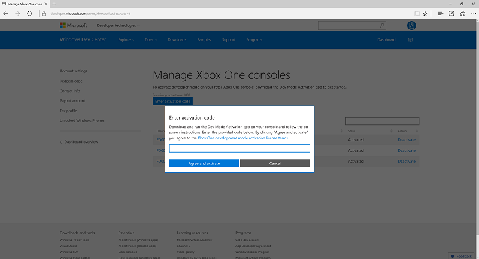

# Activation du mode développeur Xbox One

* [Fonctionnement du mode développeur](#how-developer-mode-works)
* [Activer le Mode développeur sur votre console Xbox One commerciale](#activate-developer-mode-on-your-retail-xbox-one-console)  
* [Basculer entre le Mode commercial et développeur](#switch-between-retail-and-developer-mode)

## Fonctionnement du Mode développeur
La console Xbox One possède deux modes : le Mode *commercial* (1) et le Mode *développeur* (2). En Mode commercial, la console permet à n’importe quel utilisateur de jouer et d’exécuter des applications en tant qu’utilisateur. Le Mode développeur, vous permet de développer des logiciels pour la console, mais pas de jouer à des jeux commerciaux ou d’exécuter des applications commerciales.
Ce mode peut être activé sur n’importe quelle console Xbox One commerciale. Une fois le Mode développeur activé, vous pouvez basculer entre le mode commercial (2a) et développeur (2b).

> [!NOTE]
> Vous ne pouvez activer le mode développeur sur Xbox One si vous faites partie d’un programme d’évaluation existant, tel que le programme Xbox One Beta. Vous pouvez quitter un programme d’évaluation existant à l’aide de l’application Xbox Preview Dashboard. 

## Activer le Mode développeur sur votre console Xbox One commerciale

1.    Démarrez votre console Xbox One.

2.    Recherchez l’application Dev Mode Activation dans le Marché Xbox et installez-la.  
    

3.    Accédez à **Mes jeux et applications** > **Applications**.

    
4. Ouvrez l’application Dev Mode Activation.    
    
    > [!NOTE]
    > Pour jouer à des jeux et utiliser des applications, vous devez passer en mode commercial. Les applications chargées de manière indépendante fonctionnent uniquement en mode développeur.

5.    Notez le code affiché dans l’application Dev Mode Activation.  

      
    
6.    Accédez à [developer.microsoft.com/xboxactivate](https://developer.microsoft.com/xboxactivate).
7.    Connectez-vous au Centre de développement à l’aide du compte correspondant.  
8.    Entrez le code d’activation affiché dans l’application Dev Mode Activation.   
   
    > [!NOTE]
    > Vous disposez d’un nombre limité d’activations associées à votre compte. Une fois le Mode développeur activé, le Centre de développement indique que vous avez utilisé une des activations associées à votre compte. 
    
        
    
9.    Cliquez sur **Accepter et activer**. La page sera rechargée et votre appareil apparaîtra dans le tableau.
    
    > [!NOTE]
    > Pour plus d’informations, voir [Programme d’activation du mode développeur Xbox One](http://go.microsoft.com/fwlink/p/?LinkId=760399).

10.    Après avoir saisi votre code d’activation, votre console affiche un écran de progression pour le processus d’activation.  
    
11.    Une fois l’activation est terminée, ouvrez l’application Dev Mode Activation, puis cliquez sur **Basculer et redémarrer** pour accéder au Mode développeur. Notez que cette opération peut être plus longue que d’habitude.  

       
    

    
## Basculer entre le Mode commercial et développeur
Une fois le Mode développeur activé sur votre console, utilisez **Dev Home** pour basculer entre le Mode commercial et développeur. Pour en savoir plus sur le démarrage et l’utilisation de **Dev Home**, voir [Présentation des outils Xbox One](introduction-to-xbox-tools.md).

* Pour basculer vers le Mode commercial, utilisez **Dev Home** et cliquez sur **Quitter le mode développeur**. Cette action a pour effet de redémarrer votre console en Mode commercial.    

    
  
* Pour basculer vers le Mode développeur, utilisez l’application Dev Mode Activation. Ouvrez l’application et cliquez sur **Basculer et redémarrer**. Cette action a pour effet de redémarrer votre console en Mode développeur.  

    

## Voir aussi
- [Désactivation du Mode développeur Xbox One](devkit-deactivation.md)
- [UWP sur Xbox One](index.md)

