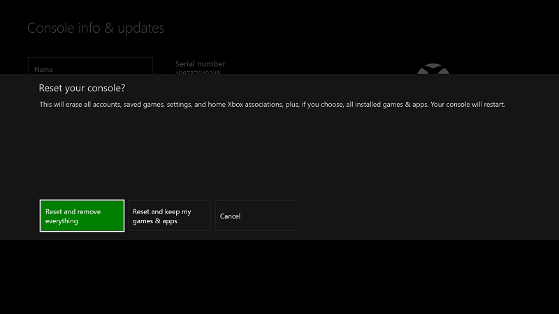

# Désactivation du mode développeur XboxOne

* [Basculer en Mode commercial](#switch-to-retail-mode)
* [Désactiver votre console à l’aide de l’application Dev Mode Activation](#deactivate-your-console-using-the-dev-mode-activation-app)  
* [Réinitialiser votre console](#reset-your-console)
* [Désactiver votre console à l’aide du Centre de développement Windows](#deactivate-your-console-using-windows-dev-center)

Si vous décidez de ne plus utiliser votre console pour le développement, procédez comme suit pour désactiver le Mode développeur.

## Basculer en Mode commercial
Tout d’abord, basculez de nouveau votre console Xbox One en Mode commercial.

1. Ouvrez **Dev Home**.
2. Cliquez sur **Quitter le mode développeur**.  Votre console redémarre en Mode commercial.  

   

Maintenant, désactivez votre console à l’aide de l’une des méthodes suivantes.

## Désactiver votre console à l’aide de l’application Dev Mode Activation

La méthode recommandée pour désactiver le Mode développeur sur votre console consiste à utiliser l’application Dev Mode Activation. 

1. Accédez à **Mes jeux et applications** > **Applications**.
  
       
   
2.  Ouvrez l’application Dev Mode Activation.    
3.  Cliquez sur **Désactiver**.
  

## Réinitialiser votre console

Vous pouvez également désactiver le Mode développeur en réinitialisant votre console.  

> [!NOTE]
> La réinitialisation de votre console entraîne la perte de toutes les données de jeu enregistrées localement.

Pour réinitialiser votre console procédez comme suit:

1.  Accédez à **Mes jeux et applications**.  
2.  Sélectionnez **Applications**, puis sélectionnez **Paramètres**.  
3.  Accédez à **Système** dans le volet gauche, puis sélectionnez **Informations de la console et mises à jour** dans le volet droit.  
4.  Accédez à **Informations de la console et mises à jour**.  
   
      
    
5.  Cliquez sur **Réinitialiser la console**.
    
    
    
6.  Ensuite, cliquez sur **Réinitialiser et supprimer tous les éléments**. Cette option rétablit la console dans sa version commerciale d’origine.  L’ensemble de vos applications, jeux et de vos données enregistrées localement seront supprimés. Notez que si vous choisissez l’option **Réinitialiser et conserver mes jeux et applications**, votre console ne sera pas supprimée du programme de développement.  
   
    

## Désactiver votre console à l’aide du Centre de développement Windows

Si vous ne parvenez pas à accéder à votre console pour une raison quelconque, vous pouvez également désactiver le Mode développeur sur votre console à l’aide du Centre de développement Windows.

1. Accédez à [developer.microsoft.com/xboxdevices](https://developer.microsoft.com/xboxdevices).    
2. Connectez-vous au Centre de développement à l’aide du compte correspondant.    
3. Recherchez la console que vous voulez désactiver dans la liste des consoles à l’aide du numéro de série ou de l’ID de la console ou de l’appareil.  
4. Cliquez sur **Désactiver**.  
  

Si vous n’avez pas encore basculé votre console Xbox One en Mode commercial, faites-le maintenant.

1. Lancez **Dev Home**.
2. Cliquez sur **Quitter le mode développeur**.  Votre console redémarre en Mode commercial.

## Voir aussi
- [Activation du Mode développeur XboxOne](devkit-activation.md)
- [UWP sur XboxOne](index.md)
