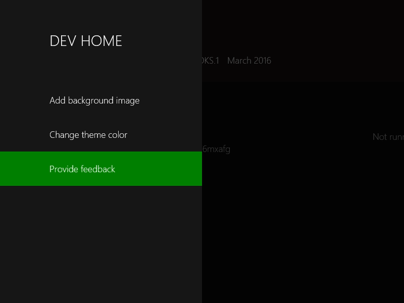
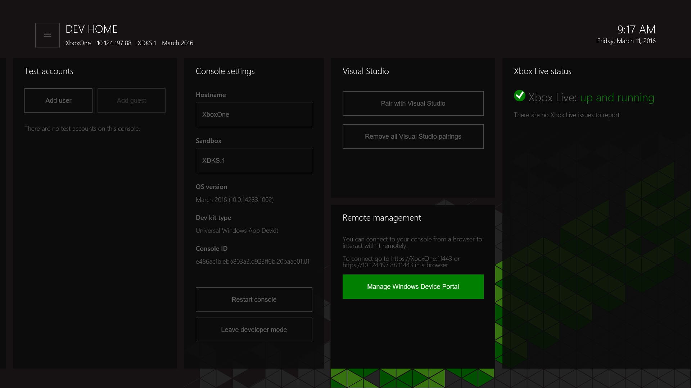

# Présentation des outils Xbox One

Cette section décrit l’outil _Accueil du développeur_ spécifiquement conçu pour Xbox One et utilisant Windows Device Portal.

## Accueil du développeur

_Accueil du développeur_ permet d’expérimenter des outils dans le Kit de développement Xbox One qui sont destinés à améliorer la productivité des développeurs. L’outil Accueil du développeur offre des fonctionnalités vous permettant de gérer et de configurer votre kit de développement.

Pour ouvrir Accueil du développeur, sélectionnez la vignette **Accueil du développeur** sur l’écran d’accueil. Si cette vignette est absente, la console n’est pas en mode développeur.

  

### Interface utilisateur
L’interface utilisateur de l’outil Accueil du développeur est divisée en plusieurs zones, décrites dans les sections ci-après. Notez que l’adresse IP de la console et son nom convivial sont affichés ici.

  

#### En-tête
L’en-tête contient des informations importantes visibles d’un seul coup d’œil sur le kit de développement. Ces informations comprennent le nom de la console, son adresse IP, le bac à sable (sandbox) Xbox Live dans lequel elle se trouve, ainsi que la version du système d’exploitation qu’elle exécute. La date et l’heure système actuelles apparaissent à l’extrémité droite de l’en-tête pour des raisons pratiques.

#### Fenêtres d’outil
L’en-tête est suivi de la zone principale de l’application, qui contient un ensemble de fenêtres d’outil configurables. Ces fenêtres sont conçues pour permettre aux développeurs de personnaliser l’application afin d’offrir un accès à différents outils et ensembles d’informations. Pour plus d’informations sur les différents outils, voir les descriptions de chacun d’eux fournies dans la suite de cet article. Pour plus d’informations sur la procédure de configuration de la disposition et de l’apparence des fenêtres d’outil, voir la section [Personnalisation de l’outil Accueil du développeur](#customizing-dev-home) plus loin sur cette page.

#### Menu principal
Vous pouvez appuyer sur la touche **Menu** de votre manette ou accéder au bouton de menu (« Hamburger ») dans le coin supérieur gauche de l’écran pour afficher le menu principal qui vous permet de configurer la couleur de thème et l’image d’arrière-plan de l’espace de travail de l’application, et de formuler des commentaires sur l’application.

  

#### Mode ancrage
Vous pouvez ancrer les outils d’Accueil du développeur sur le côté lors de l’exécution de votre titre pour accéder facilement à ces outils pendant que vous effectuez vos tests.

Pour accéder au mode **Ancrer**, sélectionnez le titre de l’outil approprié, appuyez sur la touche **Affichage** de votre manette puis, dans le menu contextuel, sélectionnez **Ancrer**.

  

L’outil Accueil du développeur s’ancrera à droite de l’écran. Vous pouvez changer de contexte en appuyant comme d’habitude deux fois sur le bouton **Nexus**.

  

#### Description des outils
| Outil    | Fonctionnalités |
|-------|--------------|
| Jeux et applications    | Répertorie les titres et applications installés dans le kit de développement et permet de les ouvrir rapidement. Vous pouvez également visualiser l’état PLM (Gestion de la durée de vie des processus) des jeux et des applications, et modifier les états PLM à partir d’un menu contextuel. |
| Utilisateurs    | Répertorie les utilisateurs actuellement inscrits sur la console. Permet la connexion/déconnexion d’utilisateurs en un clic, l’ajout d’utilisateurs et d’invités, ainsi que la visualisation des détails des utilisateurs et invités. |
| [Paramètres de la console](#console-settings) | Fournit une vue d’ensemble et des options de modification des paramètres et informations de la console. |
| Visual Studio | Permet de coupler la console avec une instance de Visual Studio pour permettre le déploiement. Si nécessaire, vous pouvez supprimer toutes les instances Visual Studio couplées existantes pour empêcher le déploiement d’applications de plateforme Windows universelle (UWP) dans un kit. |
| [Windows Device Portal](#windows-device-portal) |    Active Windows Device Portal, ou WDP (un outil de gestion d’appareils basé sur le navigateur) dans le kit. |
| État Xbox Live | Fournit l’état actuel du service Xbox Live. |
 
### Gestion de la taille de l’allocation de stockage de développement

Pour augmenter ou diminuer la quantité d’espace disque utilisée pour le stockage de développement, sélectionnez **Gérer le stockage de développement** dans le menu principal. Modifiez la valeur de la barre **Stockage de développement**, puis sélectionnez **Enregistrer et redémarrer** pour redémarrer votre console.

  

### Personnalisation de l’outil Accueil du développeur

L’outil Accueil du développeur a été conçu pour être modulable et personnalisable. Vous pouvez choisir une image d’arrière-plan et une couleur de thème pour personnaliser votre expérience de l’outil Accueil du développeur. Ces options sont disponibles dans le menu principal.

#### Redimensionnement et réorganisation des outils
Pour modifier la taille ou la position d’un outil, utilisez le bouton du menu contextuel (touche **Affichage** de votre manette) pendant que le titre a le focus. Dans le menu contextuel, sélectionnez **Déplacer** ou **Redimensionner**.

  

#### Modification de la couleur de thème et de l’image d’arrière-plan
Dans le menu principal, vous pouvez sélectionner **Modifier la couleur de thème**. Pour mettre à jour la couleur de thème utilisée pour la mise en surbrillance du focus, sélectionnez une nouvelle couleur, puis cliquez sur **Enregistrer**.

  

### Formulation de commentaires
Pour fournir des commentaires concernant l’outil Accueil du développeur ou l’un des processus d’outil, sélectionnez l’option **Fournir un commentaire** dans le menu principal.

  

## Paramètres de la console
L’outil Paramètres de la console vous permet d’accéder rapidement aux paramètres du kit de développement.

### Définition d’un nom d’hôte pour la console
Lorsque vous communiquez avec la console à partir de votre PC de développement, vous pouvez définir un nom convivial (appelé _nom d’hôte_) pour le kit de développement Xbox One à utiliser comme alternative à l’adresse IP de la console. Votre PC de développement et le kit de développement doivent figurer sur le même sous-réseau pour que la connectivité de nom d’hôte puisse fonctionner.  

Pour définir un nom d’hôte pour un kit de développement, accédez à l’outil Paramètres de la console et tapez le nom d’hôte dans la zone __Nom d’hôte__.  

> [!NOTE]
> L’unicité de nom n’est pas appliquée lorsque le nom d’hôte est créé. Veillez à éviter les doublons. Une façon de procéder consiste à dériver le nom d’hôte du nom de votre ordinateur de développement, qui est généralement unique au sein d’une organisation.

## Windows Device Portal
Windows Device Portal (WDP) est un outil de gestion d’appareils OneCore basé sur le navigateur.

> [!NOTE]
> Pour plus d’informations sur WDP, voir [Vue d’ensemble de Windows Device Portal](../debug-test-perf/device-portal.md).

Pour activer WDP sur votre console Xbox One :

1. Sélectionnez la vignette Accueil du développeur sur l’écran d’accueil.

  

2. Dans Accueil du développeur, accédez à l’outil **Gestion à distance**.

  

3. Sélectionnez __Gérer Windows Device Portal__, puis appuyez sur la touche __A__.
4. Cochez la case __Activer Windows Device Portal__.
5. Renseignez les zones __Nom d’utilisateur__ et __Mot de passe__, puis enregistrez-les. Ces informations sont utilisées pour authentifier l’accès à votre kit de développement à partir d’un navigateur.
6. Fermez la page __Paramètres__, puis notez l’URL indiquée sur l’outil _Gestion à distance_ pour se connecter.
7. Entrez l’URL dans votre navigateur, puis connectez-vous avec les informations d’identification que vous avez configurées.
8. Vous recevrez un avertissement concernant le certificat fourni, semblable à la capture d’écran ci-dessous, car le certificat de sécurité signé par votre console Xbox One n’est pas considéré comme un éditeur approuvé bien connu. Cliquez sur **Poursuivre sur ce site web** pour accéder à Windows Device Portal.

  

## Compagnon du mode de développement Xbox
Le Compagnon du mode de développement Xbox est un outil qui vous permet de travailler sur votre console sans quitter votre PC. L’application vous permet d’afficher l’écran de la console et d’y envoyer des données. Pour plus d’informations, voir [Compagnon du mode de développement Xbox](xbox-dev-mode-companion.md).

## Voir également
- [Utilisation de Fiddler avec Xbox One lors du développement pour UWP](uwp-fiddler.md)
- [Vue d’ensemble de Windows Device Portal](../debug-test-perf/device-portal.md)
- [UWP sur Xbox One](index.md)

----

